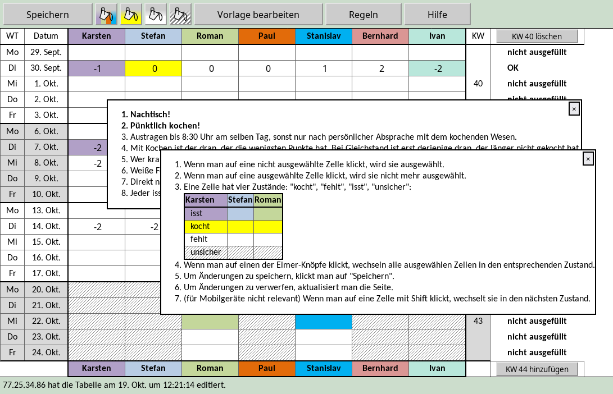

This app tracks whose turn it is to cook in our small cooking group. Before that, it was
done with an Excel sheet.

This is what it looks like:



# Running

First, create a file called `data.json` containing the names of the group members and
their schedules. For a small example, see `data.json.example`.

Create a Python environment with a tool of your choice, then install the requirements,
e.g. like this:

```sh
pip install -r requirements.txt
```

Then, start the app:

```sh
./run.sh
```
